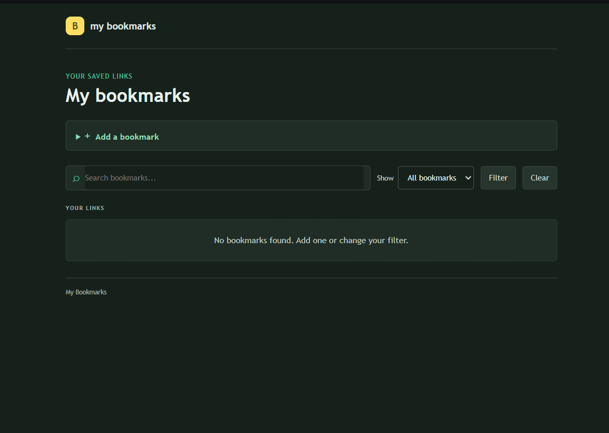
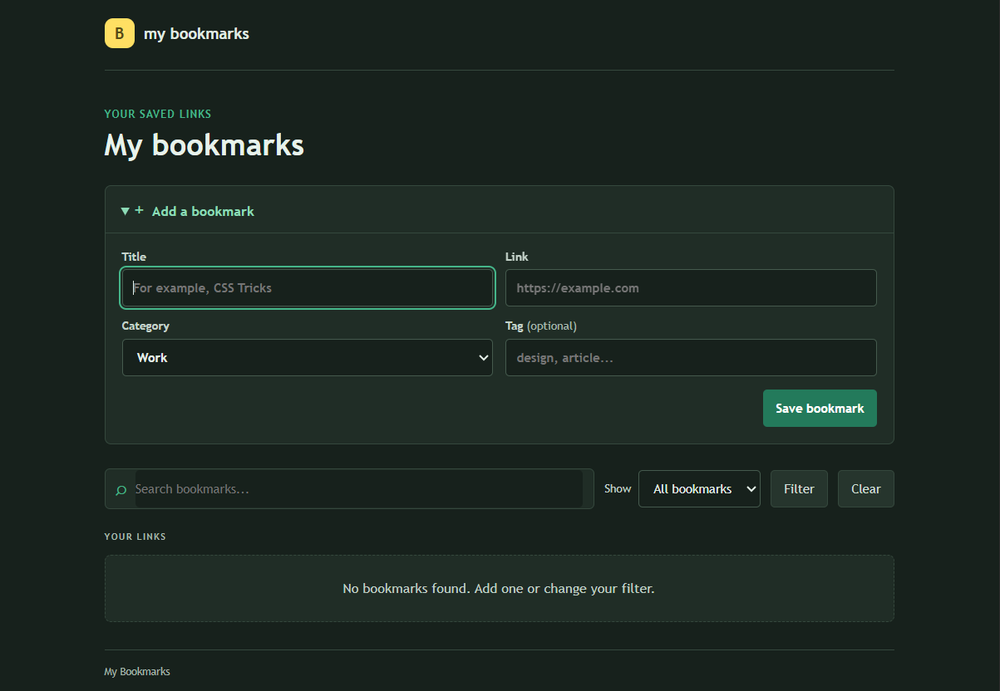

# Python Bookmark Manager

A simple web app for saving and organizing links.

## Tools used

- **Python** - app logic
- **Flask** - runs the web app
- **SQLite** - saves bookmarks in a local database
- **HTML and CSS** - page structure and styling

## Features

- Add, edit, and delete bookmarks
- Search bookmarks and filter by category
- Mark and view favorite bookmarks
- Add an optional tag to each bookmark

## Screenshots

### Initial page



### Add a bookmark



## Run locally

Install Flask and run the app:

```powershell
pip install -r requirements.txt
python app.py
```

Open http://127.0.0.1:5000. Bookmarks are saved automatically in a local SQLite database.
